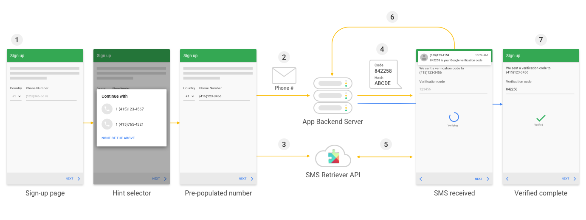

# SMS 인증번호를 읽어와 자동 입력하기
2018년 10월에 구글에서 공지한 '통화 기록 및 SMS 사용 권한 제한'에 따라, 

2019년 1월부터 '통화 기록 및 SMS 사용 권한 제한' 정책은 전화나 문자를 주 기능으로 하는 앱이 아니면 SMS 권한을 획득할 수 없다고 합니다. 

이 경우 단순히 '인증번호 자동 입력' 기능 구현을 위한 앱은 'SMS Verification API'를 사용하는 방식으로 구현하여야 합니다.

- 참고
    - http://woowabros.github.io/experience/2019/03/08/googleplay_permission_policy.html
    - https://developers.google.com/identity/sms-retriever/overview
    
# SMS Retriever API
## 소개
google developer 에서 소개하는 SMS Retriever API 내용을 간략하게 보자면 아래와 같이 설명하고 있습니다.

> SMS Retriever API를 사용하면 사용자가 수동으로 인증 코드를 입력하지 않고도 추가 앱 권한이 없어도 
Android 앱에서 SMS 기반 사용자 확인을 자동으로 수행 할 수 있습니다.
<br>
SMS Retriever API 는 Play Service 버전 10.2 이상이 설치 된 Android 기기에서만 사용 할 수 있습니다.


## 동작 
앱에서 자동 SMS 확인을 구현하면 확인 과정은 다음과 같습니다.



1. 사용자가 앱에서 SMS 인증 단계를 시작하면 전화번호를 입력하라고 요구하거나, [Smart Lock for Passwords hint selector](https://developers.google.com/identity/smartlock-passwords/android/retrieve-hints) 를 이용해서 전화번호를 입력하게 할 수 있습니다.

2. 앱에서 백엔드 서버에 인증번호를 요청하게 되고, 사용자 데이터베이스에서 사용 가능한 정보에 따라 이 요청에는 사용자의 ID, 사용자의 전화 번호 또는 둘다가 포함 될 수 있습니다.

3. 동시에 앱은 SMS Retriever API 를 호출하여 서버에서 SMS 응답 수신을 시작합니다.

4. 서버는 서버로 다시 전송 될 일회성 코드와 앱을 식별하는 해시를 포함하는 SMS 메시지를 사용자에게 보냅니다

5. 사용자의 기기가 SMS 메시지를 수신하면 Google Play 서비스는 앱 해시를 사용하여 메시지가 앱용임을 확인하고 SMS 리트리버 API를 통해 앱에서 메시지 텍스트를 사용할 수 있도록합니다.

6. 앱은 메시지 텍스트에서 일회용 코드를 구문 분석하여 서버로 다시 보냅니다.

7. 서버는 앱에서 일회용 코드를 수신하고 코드를 확인한 다음 사용자가 자신의 계정을 성공적으로 확인했음을 기록합니다.
<br>

복잡해 보이지만, Hint Selector 기능을 이용하지 않으면, 아주 간단하게 사용할 수 있습니다.

안드로이드에서는 retriever api 를 실행 시킨 후 retriever api 에서 제공하는 action 이벤트를 필터링 하는 receiver 등록해놓고

디바이스에서 수신하는 sms 를 읽어와 receiver 에게 retriever api 가 알려줄 때 그걸 받아서 활용하면 됩니다.
<br>

간단하죠?!  
    
# 안드로이드
## 의존성 추가
app build.gradle 에 아래 의존성을 추가 합니다.

```
implementation 'com.google.android.gms:play-services-auth:17.0.0'
implementation 'com.google.android.gms:play-services-auth-api-phone:17.4.0'
```

## 기능 구현

먼저, 원하는 타이밍에 retriever api 를 starting 시켜줍니다. <br>
저는 send 버튼을 눌렀을 때 starting 시켜주는 걸로 했습니다.

```
    fun startSmsRetriver() {
        val task = SmsRetriever.getClient(this)
            .startSmsRetriever()

        task.addOnSuccessListener {
            Log.d(LOG, "addOnSuccessListener ${getAppSignatures(this)}")
        }

        task.addOnFailureListener {
            Log.e(LOG, "addOnFailureListener $it")
        }
    }
```

receiver class 를 정의하고, 이를 등록하여 줍니다.

```
    inner class MySMSReceiver : BroadcastReceiver() {

        override fun onReceive(context: Context, intent: Intent) {
            if(SmsRetriever.SMS_RETRIEVED_ACTION == intent.action){
                val extras = intent.extras
                val status = extras?.get(SmsRetriever.EXTRA_STATUS) as? Status

                when(status?.statusCode){
                    CommonStatusCodes.SUCCESS -> {

                        // Get SMS message contents
                        val message = extras?.get(SmsRetriever.EXTRA_SMS_MESSAGE) as? String

                        // Extract one-time code from the message and complete verification
                        // by sending the code back to your server.
                        Log.d(LOG, "onReceive\$SUCCESS $message")

                        if(!message.isNullOrEmpty()){
                            showMessage(message)
                        }
                    }

                    CommonStatusCodes.TIMEOUT -> {
                        // Waiting for SMS timed out (5 minutes)
                        // Handle the error ...
                        Log.d(LOG, "onReceive\$TIMEOUT")
                    }
                }
            }
        }

        fun doFilter(): IntentFilter = IntentFilter().apply {
            addAction(SmsRetriever.SMS_RETRIEVED_ACTION)
        }
    }
    
    //receiver 등록
    override fun onCreate(savedInstanceState: Bundle?) {
        ....
        registerReceiver(smsReceiver, smsReceiver.doFilter())
    }
    
    //receiver 해제
    override fun onDestroy() {
         unregisterReceiver(smsReceiver)
         super.onDestroy()
    }
```

AndroidManifest.xml 에 receiver 를 등록하여 줍니다.

```
        <receiver
            android:name=".MainActivity$MySMSReceiver"
            android:permission="com.google.android.gms.auth.api.phone.permission.SEND"
            android:exported="true">
            <intent-filter>
                <action android:name="com.google.android.gms.auth.api.phone.SMS_RETRIEVED"/>
            </intent-filter>
        </receiver>
```


그리고 마지막으로 서버로 전송할 해시키를 구하여줍니다.

해시키를 구하는 이유는 해당 앱에 해당하는 해시키를 확인하여 retriever api 가 <br>

저희앱의 broadcast receiver 에 이벤트를 날려주기 때문입니다.

해시키가 다르면 이벤트를 받을 수 없습니다~!


```
    fun getAppSignatures(context: Context): List<String> {
        val appCodes = mutableListOf<String>()

        try {
            // Get all package signatures for the current package
            val packageName = context.packageName
            val packageManager = context.packageManager
            val signatures = packageManager.getPackageInfo(packageName, PackageManager.GET_SIGNATURES).signatures

            // For each signature create a compatible hash
            for (signature in signatures) {
                val hash = getHash(packageName, signature.toCharsString())

                if (hash != null) {
                    appCodes.add(String.format("%s", hash))
                }

                Log.d(LOG, String.format("이 값을 SMS 뒤에 써서 보내주면 됩니다 : %s", hash))
            }
        } catch (e: PackageManager.NameNotFoundException) {
            Log.d(LOG, "Unable to find package to obtain hash. : $e")
        }

        return appCodes
    }

    private fun getHash(packageName: String, signature: String): String? {
        val appInfo = "$packageName $signature"

        try {
            val messageDigest = MessageDigest.getInstance(HASH_TYPE)

            // minSdkVersion이 19이상이면 체크 안해도 됨
            if (Build.VERSION.SDK_INT >= Build.VERSION_CODES.KITKAT) {
                messageDigest.update(appInfo.toByteArray(StandardCharsets.UTF_8))
            }

            // truncated into NUM_HASHED_BYTES
            val hashSignature = Arrays.copyOfRange(messageDigest.digest(), 0, NUM_HASHED_BYTES)

            // encode into Base64
            val base64Hash = Base64
                .encodeToString(hashSignature, Base64.NO_PADDING or Base64.NO_WRAP)
                .substring(0, NUM_BASE64_CHAR)

            Log.d(LOG, String.format("\nPackage : %s\nHash : %s", packageName, base64Hash))

            return base64Hash

        } catch (e: NoSuchAlgorithmException) {
            Log.d(LOG, "hash:NoSuchAlgorithm : $e")
        }

        return null
    }
```

이렇게 되면 android client 에서 할 작업은 끝나게 됩니다

이제 서버쪽에서 해야할 작업을 보겠습니다.

# 서버 작업
서버 작업에는 사실 딱히 할게 없는데요

이미 sms 를 보내는 api 가 백엔드 서버에 완성 되있을 것이고, 변경 되어야 하는 부분은 기존의 인증번호를 보내주던 sms 내용의 변경입니다.

단, 이 메시지를 android client 수신하기 위해서는 몃가지 제약조건이 있습니다.

이것만 지켜줘서 보내면 쉽게 처리 할 수 있습니다.
<br>

1. 메시지 내용은 무조건 <#> 라는 문자로 시작해야한다.

2. 메시지 내용은 140 byte 이하 여야 한다.

3. 앱을 식별하는 11자리 hash code 로 끝나야 한다. (앱에서 전달 받아야합니다.)
<br>

예를 보겠습니다.

```
<#> 인증번호: 1234
Yr60Qo0VGAq
```


<#> 형식으로 시작하고 hash code 로 끝나는 메시지 내용이 아니면 

retriever api 가 메시지를 읽어오지 못 하니 반드시 형식을 맞춰줘야 합니다.

# 플로우 정리

1. client 에서 receiver 를 등록하고, sms retriever api stating 하여 줍니다.

2. 사용자의 휴대폰 번호와 함께 11자리 hash code 를 구하여 백엔드 서버에 전달하여 줍니다.

3. 백엔드 서버에서 전달 받은 hash code 와 함께 메시지 양식을 지켜, 해당 번호로 전달합니다.

4. client 에서 등록한 receiver 로 sms message 를 수신하게 되고 이를 사용하여 기능을 완성합니다.
<br>

# 전체 코드 보러가기

전체 코드는 아래 주소에서 볼 수 있습니다.

- [https://github.com/Linitial/SmsReadingExample](https://github.com/Linitial/SmsReadingExample)

이상으로 포스팅을 마치겠습니다.

감사합니다.


